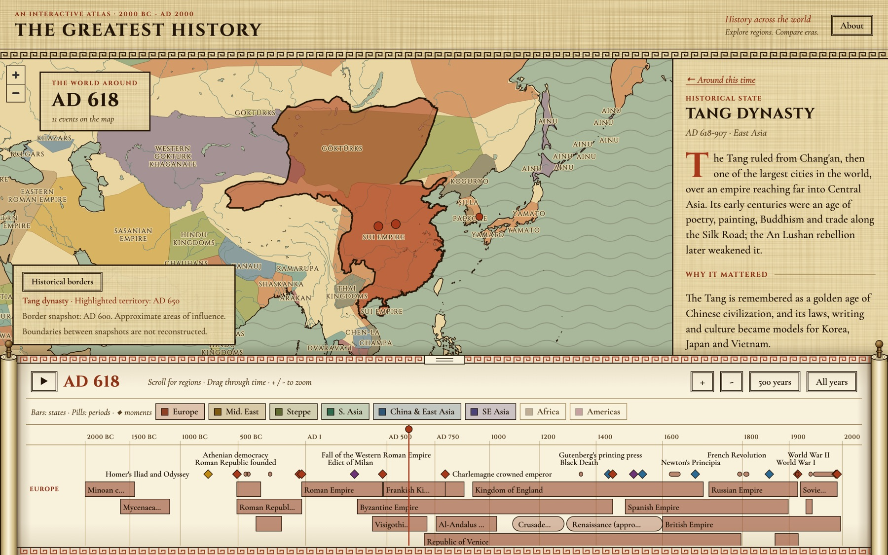

# The Greatest History

[](https://github.com/jeff613/the-greatest-history-events/actions/workflows/ci.yml)

An interactive world map and timeline of history from 2000 BC to AD 2000, built to show what was happening in different parts of the world at the same time.



## What it shows

- **One timeline for everything.** Each region has a lane with its states as solid bars, its periods (wars, movements, influential lives) as round-ended pills, and single moments as diamonds above them.
- **A map that follows the year.** Historical borders change as you move through time. Selecting a state highlights its territory; selecting a moment zooms to where it happened.
- **A reading pane.** With nothing selected it lists what was in progress and what happened around the current year. Select an entry for a short description, why it mattered, what it was part of, its key moments, and a Wikipedia link.
- **Shareable links.** The year, zoom and selected entry are kept in the URL.
- **English and Simplified Chinese.** Use the English / 中文 buttons in the header to switch the interface and historical entries. Every page load starts in Simplified Chinese with all regions selected; switching languages preserves the selected entry, timeline and map view.

The collection focuses on Europe and Asia and includes major turning points elsewhere. It contains 608 entries: 362 moments, 83 periods and 163 states. East Asia includes 118 moments, with expanded coverage of Chinese philosophy, science, literature, trade, institutions and modern history.

## Exploring the timeline

Fresh page loads start in Simplified Chinese with all eight regions and all three entry types selected. Use **English / 中文** to switch language, the region buttons to choose comparisons, and **States / Periods / Moments** to show or hide each type. These choices reset on reload; shared URLs preserve the year, zoom and selected entry.

Use **100 years**, **500 years**, **All years**, or the **+ / -** buttons to change the visible span. The detail indicator explains which event tiers are showing. Zooming in adds events while retaining the higher tiers. A selected event remains visible regardless of tier when its date is in view, subject to region and type filters.

Chinese states and periods occupy adjacent rows within East Asia, followed by Japanese and Korean groups. Rows are packed for the visible time window and selected types. Short periods appear once as labelled markers when their names cannot fit inside a bar. Scroll to browse regions, drag to move through time, and drag the timeline's upper edge to adjust its height.

The shape filters form a compact ink-colored group, separate from the colored region buttons. Dates sit below titles in the reading pane. On phones, the pane's collapse handle stays reachable while scrolling, and collapsing returns to the heading. Entry descriptions use a decorative first character, with separate sizing for English and Chinese.

## Getting started

Requires Node.js 20.11 or later.

```sh
git clone https://github.com/jeff613/the-greatest-history-events.git
cd the-greatest-history-events
npm run setup   # install dependencies, download map data, install Playwright's Chromium
npm run dev     # http://localhost:5173
```

`npm run setup` downloads the border and base map data into `public/` (about 50 MB once processed). That data is not stored in this repository.

## Commands

| Command | What it does |
|---|---|
| `npm run dev` | Start the dev server |
| `npm run build` | Validate the data, typecheck, and build to `dist/` |
| `npm test` | Unit tests (Vitest) |
| `npm run test:e2e` | Browser tests (Playwright); builds and previews the site first |
| `npm run validate` | Validate everything in `data/` |
| `npm run check-links` | Check that every entry's Wikipedia link resolves |
| `npm run fetch-geo` | Download and correct the border and base map data again |

## Content

All content lives in `data/timeline/`, one JSON file per millennium. Every entry is the same kind of record:

```json
{
  "id": "fall-of-constantinople",
  "kind": "moment",
  "title": "Fall of Constantinople",
  "start": 1453,
  "end": null,
  "dateLabel": "29 May 1453",
  "region": "europe",
  "category": "politics",
  "importance": 3,
  "location": { "name": "Constantinople (Istanbul)", "lat": 41.02, "lng": 28.94 },
  "summary": "What happened, in two or three sentences.",
  "significance": "Why it mattered, in one or two sentences.",
  "wikipedia": "https://en.wikipedia.org/wiki/Fall_of_Constantinople"
}
```

- Moment importance is editorial: `3` for world-changing highlights, `2` for major regional or thematic milestones, `1` for closer detail. Avoid assigning every new entry to the highest tier. The timeline shows tier 3 at spans over 1,500 years, adds tier 2 at 1,500 years or less, and adds tier 1 at 300 years or less. Selected moments stay visible within the visible range regardless of tier, subject to region/type filters. States and periods remain visible as context. Label placement prioritizes the selection, then importance; crowded markers may remain unlabelled until closer zoom.
- `kind` is `state`, `period` or `moment`. A moment has no `end`; a state or period must have one.
- A moment or period can name the states and periods it belongs to: `"partOf": ["byzantine", "ottoman"]`. These links are what the card shows as "Part of" and "Key moments".
- New East Asian state or period IDs should be added to the appropriate presentation group in `src/lib/packEras.ts`; moments do not require this mapping. These groups arrange rows, not territorial claims.
- Years are signed integers with no year zero: `-44` is 44 BC.
- `npm run validate` checks every rule and names the file, entry and field when one is broken.

The conventions for working in the code are in [AGENTS.md](AGENTS.md), and the design is described in [docs/superpowers/specs](docs/superpowers/specs).

## Translations

English stays in each record's existing fields. Its `zh` object supplies Chinese `title`, `summary` and `significance`, plus `locationName` and `dateLabel` when the English record has those fields. Keep both languages up to date when adding or editing content. IDs, relationships, coordinates and Wikipedia URLs are shared; Wikipedia links still open the English articles.

`src/state/LocaleContext.tsx` provides the language state, interface text and localized entry views. Date formatting lives in `src/lib/years.ts`. Language is not stored in the URL or browser storage, so reloading returns to Simplified Chinese regardless of the browser language.

`data/locales/map.zh.json` translates major map labels by their source names. Names without a translation retain the original label. Keep canonical border names unchanged so territory matching continues to work. Chinese text uses system Chinese serif fonts.

`npm test` checks translation coverage for every entry and preserves shared record fields. `npm run test:e2e` checks the Chinese default, language switching, related entries, the About dialog and the mobile layout.

## Accuracy

Borders are approximate. Before the modern era most states had no fixed frontiers, and many overlapped, so treat the shaded areas as a rough picture of who held sway. The map shows the nearest border snapshot at or before the selected year, not a reconstruction of every year.

The entries are short summaries, and every one links to Wikipedia for further reading. If you find a mistake, please [open an issue](https://github.com/jeff613/the-greatest-history-events/issues).

## Verification and release status

Local verification on 2026-10-08 passed 128 unit tests, 52 browser tests, data validation, TypeScript checking and the production build. The 140 entries added in this update have checked Wikipedia links and English/Simplified Chinese text. Browser coverage includes zoom tiers, selection retention, region/type filters, Chinese defaults, shared links and phone layouts.

`main` is the website's release branch. Pushing runs CI but does not publish the site. Deployment is a separate operations step using the latest remote `main`; generated `dist/` files and downloaded map assets are not committed.

## Data sources

- Historical borders: [historical-basemaps](https://github.com/aourednik/historical-basemaps) by André Ourednik and contributors, GPL-3.0, with wrong labels corrected.
- Replacement shapes and five added snapshots: [Cliopatria](https://github.com/Seshat-Global-History-Databank/cliopatria) by the Seshat Global History Databank, [CC BY 4.0](https://creativecommons.org/licenses/by/4.0/), cut to fit the surrounding borders.
- Land, lakes and rivers: [Natural Earth](https://www.naturalearthdata.com/), public domain.
- Type: Cinzel and Cormorant Garamond, SIL Open Font License, with Open Sans (Apache License 2.0) as the fallback for map labels. Map rendering: [MapLibre GL JS](https://maplibre.org/).

These datasets are downloaded by `npm run fetch-geo` and keep their own licenses. A site built from this project includes them, so it must follow their terms.

## License

[MIT](LICENSE) for the code and written content in this repository.
